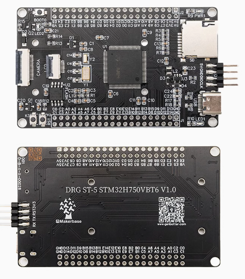

# DRG ST-5 STM32H750VBT6

---

## English

### General Introduction

* STM32H750VET6 minimum development board, with SPI screen interface and camera interface. It can be used with OV2640 or OV5640 camera base plate and 1.69 - inch SPI screen.
* Resources for the Makerbase&GenBotter DRG ST-5 STM32H750VBT6 minimum development board, including PCB, DEMOs, STM32H7x official manuals, schematic diagrams, development tools, and information of supporting modules, etc.

### Directory of Resourses

|Directory|Introdution|
|--|--|
|01 Package |JLCPCB standard version PCB file|
|02 Demos |	HAL library routines using Keil MDK as an integrated development environment. There is no accompanying video explanation, including OpenMV firmware, comprehensive test routines, etc.|
|03 ST Official Manuals | Including reference manuals and data sheets downloaded from ST official website|
|04 Schematic Diagram	| Schematic diagram of the development board (in PDF format)|
|05 Screen Module Information |	Including reference manuals and data sheets downloaded from ST official website, etc.|
|06 Camera Module Information	| Including reference manuals and data sheets downloaded from ST official website, etc.|
|07 Supplementary Materials	| USB - DFU download tutorial, off - chip FLASH external download tutorial, OpenMV tutorial |

### Hardware Platform

* DRG ST - 5 STM32H750VBT6 Development Board
* TFT Screen (1.69 inches, SPI interface, non - touch, optional)
* Camera (OV2640 or OV5640 module, optional)

### 联系方式

|   |  |
|--:|:--|
|QQ Group: | 366182133 |
|Bilibili: |<https://space.bilibili.com/486637340>|
|TaoBao Link: |<https://genbotter.taobao.com/>|
|WeChat Official Account: |GenBotter|

---

## 中文

### 介绍

* st_5 stm32h750vet6最小系统板，含spi屏接口、摄像头接口，可以配套ov2640摄像头底板、1.69spi屏使用。
* Makerbase DRG ST-5 STM32H750VBT6开发板的配套资源，PCB、参考例程、ST官方手册、原理图、开发工具、配套模块资料等。

### 内容简介

|名称|简介|
|--|--|
|01 封装    | 嘉立创标准版PCB文件|
|02 参考例程_HAL库  | 使用keil MDK作为集成开发环境的HAL库例程，没有配套视频讲解，包括OpenMV固件、综合测试例程等 |
|03 ST官方手册 | 包括在ST官方下载的参考手册、数据手册 |
|04 原理图 |开发板的原理图（pdf格式）|
|05 屏幕模块资料 | 包括在ST官方下载的参考手册、数据手册等|
|06 摄像头模块资料 | 包括在ST官方下载的参考手册、数据手册等|
|07 补充材料 | USB--DFU 下载教程、片外FLASH外置下载教程、OpenMV教程|

### 硬件平台

* DRG ST-5 STM32H750VBT6开发板
* TFT屏（1.69寸，SPI接口，没有触摸，选配）
* 摄像头（OV2640,200万像素，选配）

### 联系方式

|   |  |
|--:|:--|
| Q群：      |366182133|
| B站：      |<https://space.bilibili.com/486637340>|
| 开发板购买：|<https://genbotter.taobao.com/>|
| 微信公众号：| GenBotter|
